<p align="center">
  
</p>
<h1 align="center">Windows Server Active Directory Lab</h1>

<p align="center">
  Local Microsoft infrastructure lab using Windows Server 2022, Active Directory Domain Services, DNS, Group Policy, SMB file shares, NTFS permissions, and a domain-joined client.
</p>

<p align="center">
  <strong>DC01</strong> · <strong>CLIENT01</strong> · <strong>erikcloud.local</strong> · <strong>AD DS</strong> · <strong>DNS</strong> · <strong>GPO</strong>
</p>

# Windows Server Active Directory Lab

A local Microsoft infrastructure lab built with **Windows Server 2022**, **Active Directory Domain Services**, **DNS**, **Group Policy**, SMB file shares, and a domain-joined client.

The goal was to build a small company-style Windows domain and prove core infrastructure concepts end-to-end.

---

## Lab Overview

| Component         | Purpose                                          |
| ----------------- | ------------------------------------------------ |
| `DC01`            | Domain Controller, DNS Server, File Share Server |
| `CLIENT01`        | Domain-joined client machine                     |
| `erikcloud.local` | Active Directory domain                          |
| `Group-IT`        | IT file share access group                       |
| `Group-HR`        | HR file share access group                       |
| `Group-Finance`   | Finance file share access group                  |

---

## Architecture

```text
CLIENT01
   |
   | DNS / Authentication / SMB
   v
DC01
   |
   ├── Active Directory Domain Services
   ├── DNS Server
   ├── Group Policy
   └── SMB File Shares
        ├── \\DC1\IT
        ├── \\DC1\HR
        └── \\DC1\Finance
```

---

## 1. Domain Controller Build

Installed Windows Server 2022 and promoted `DC01` to a Domain Controller for:

```text
erikcloud.local
```

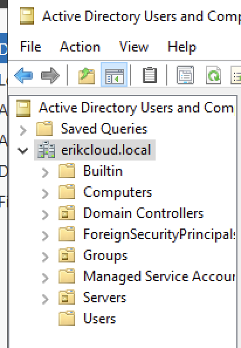

---

## 2. Active Directory Users and Groups

Created department security groups:

- `Group-IT`
- `Group-HR`
- `Group-Finance`
- `Group-Managers`

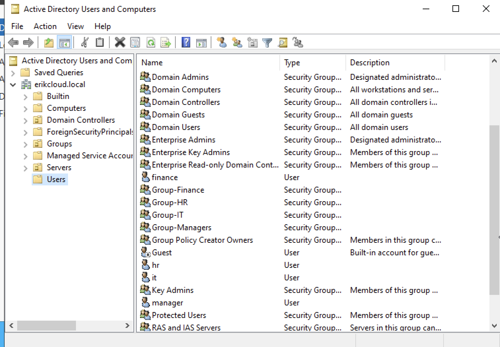

Created test users and assigned them to groups:

```text
it.user1       → Group-IT
hr.user1       → Group-HR
finance.user1  → Group-Finance
manager.user1  → Group-Managers
```

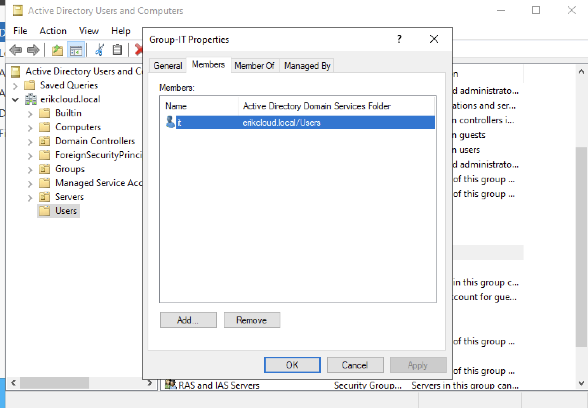

---

## 3. File Shares and NTFS Permissions

Created department folders:

```text
C:\Shares\IT
C:\Shares\HR
C:\Shares\Finance
```

Created SMB shares:

```text
\\DC1\IT
\\DC1\HR
\\DC1\Finance
```

Configured group-based NTFS permissions:

| Share           | Security Group  | Permission |
| --------------- | --------------- | ---------- |
| `\\DC1\IT`      | `Group-IT`      | Modify     |
| `\\DC1\HR`      | `Group-HR`      | Modify     |
| `\\DC1\Finance` | `Group-Finance` | Modify     |

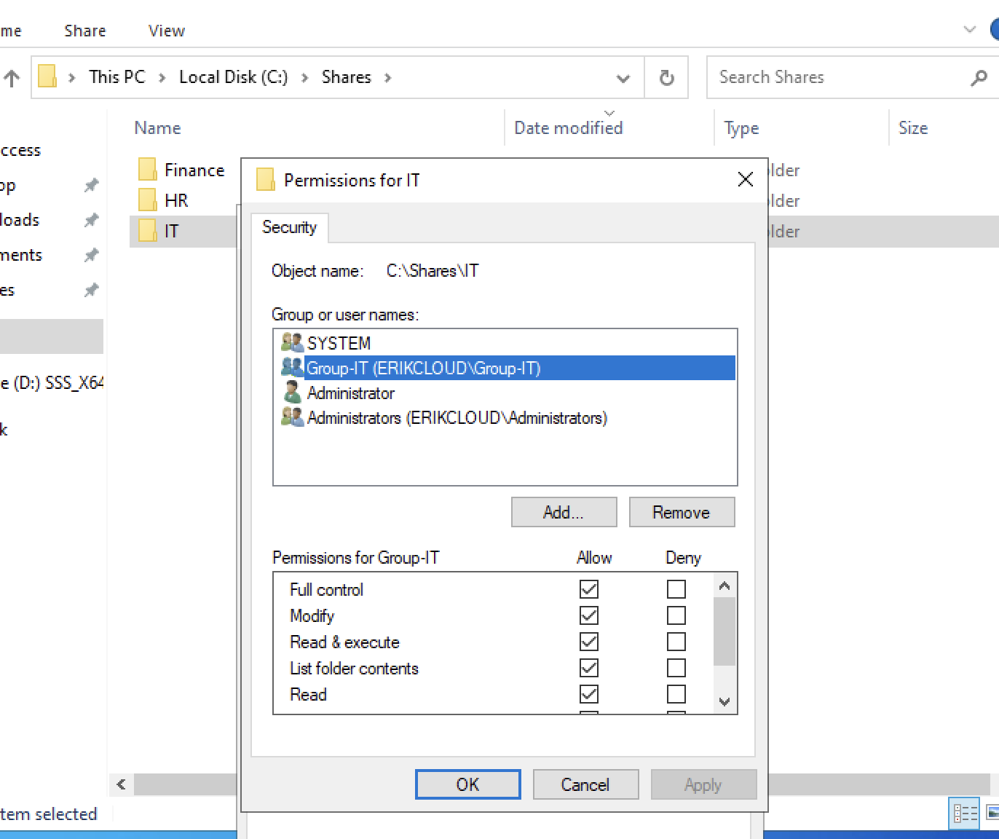

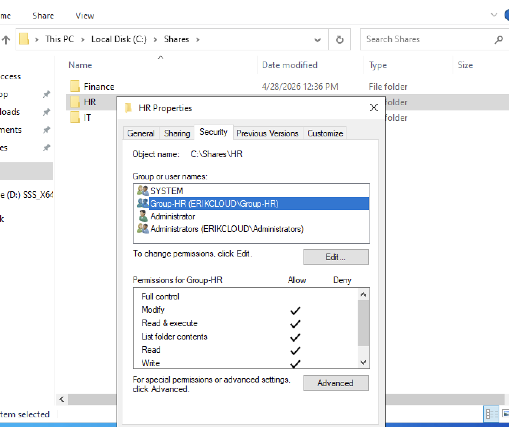

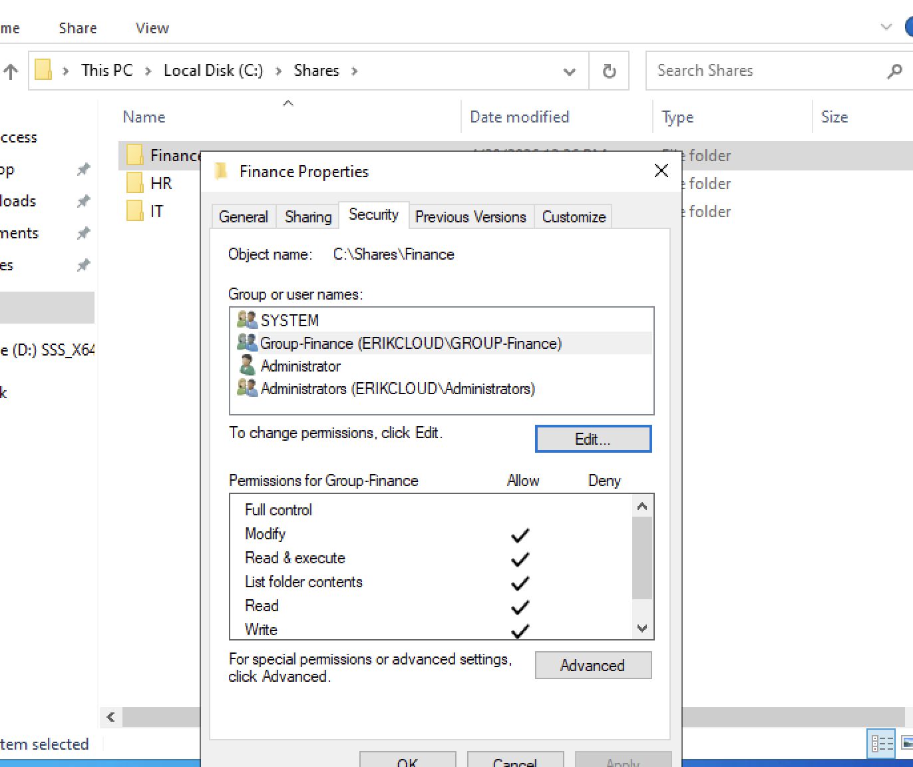

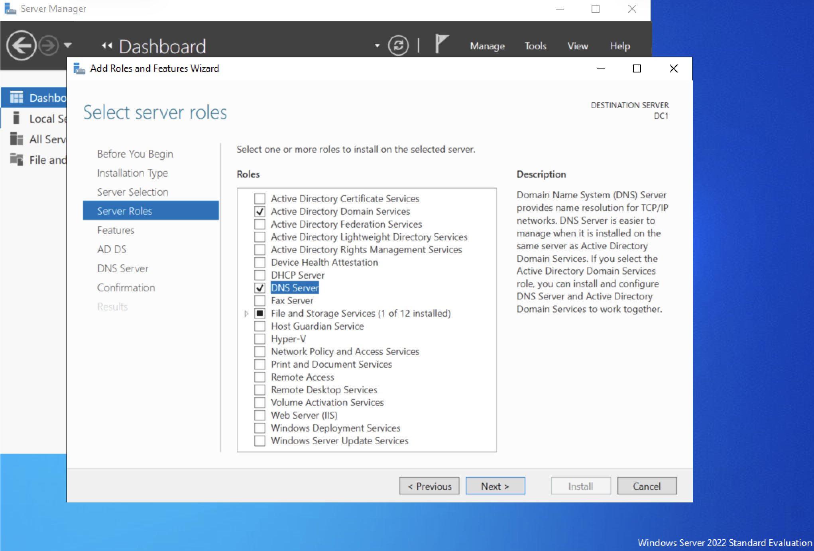

---

## 4. Group Policy Baseline

Created and linked a domain-level Group Policy Object:

```text
Group-Domain-Baseline
```

Configured password policy:

- Minimum password length: `10`
- Password complexity: `Enabled`

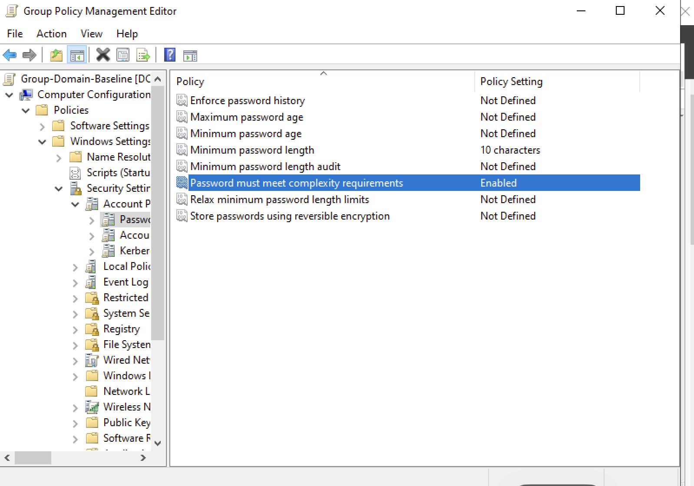

Verified policy application using:

```powershell
gpupdate /force
gpresult /r
```

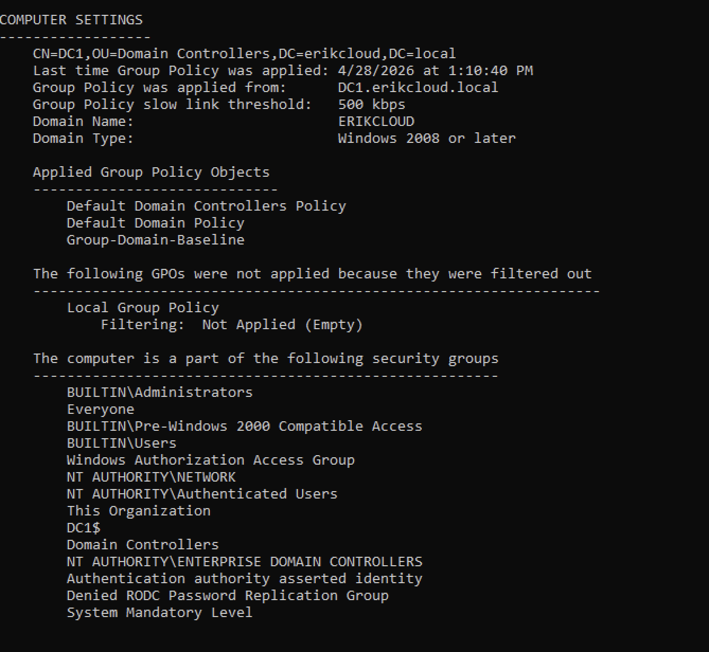

---

## 5. DNS Configuration and Testing

Created an internal DNS A record:

```text
app01.erikcloud.local → 192.168.64.50
```

Verified DNS resolution using:

```powershell
nslookup app01.erikcloud.local 127.0.0.1
```

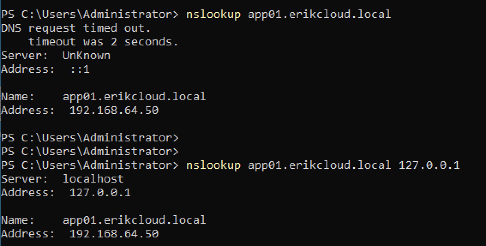

Verified Domain Controller discovery from the client using:

```powershell
nltest /dsgetdc:erikcloud.local. /force
```

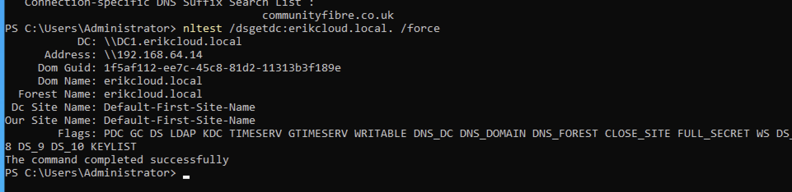

---

## 6. Domain-Joined Client

Joined `CLIENT01` to the domain:

```text
erikcloud.local
```

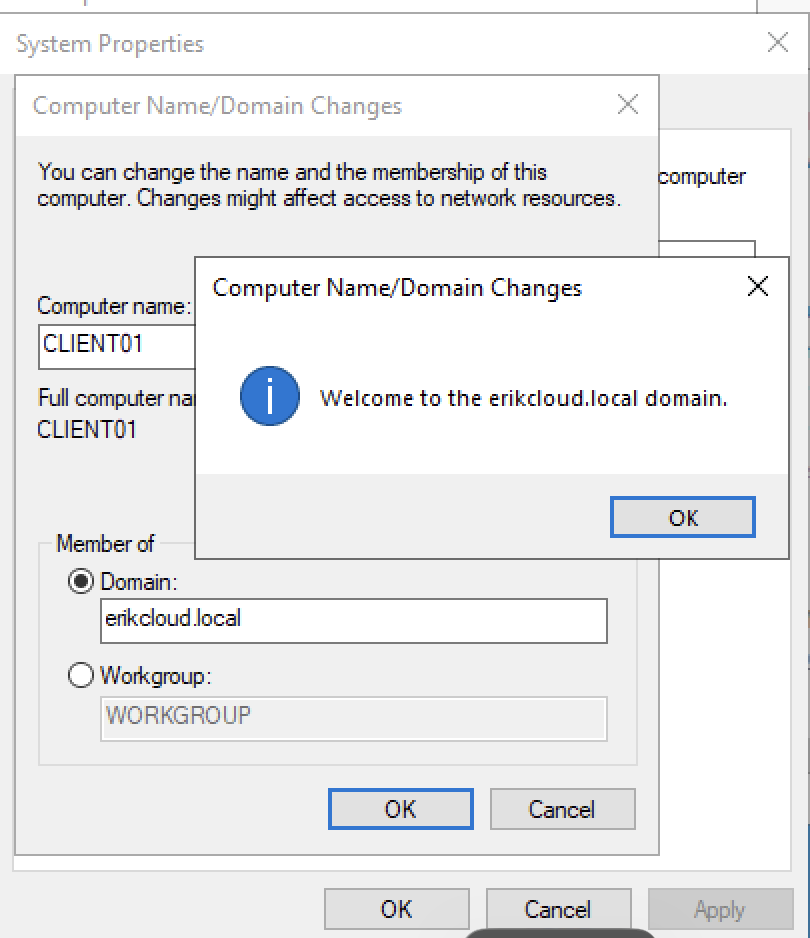

This confirmed that `CLIENT01` could:

- Resolve the domain through DNS
- Locate the Domain Controller
- Join the Active Directory domain
- Authenticate domain users

---

## 7. Access Control Validation

Logged into `CLIENT01` as:

```text
ERIKCLOUD\finance.user1
```

Validated access:

| Test            | Result  |
| --------------- | ------- |
| `\\DC1\Finance` | Allowed |
| `\\DC1\IT`      | Denied  |
| `\\DC1\HR`      | Denied  |

Finance share access succeeded:

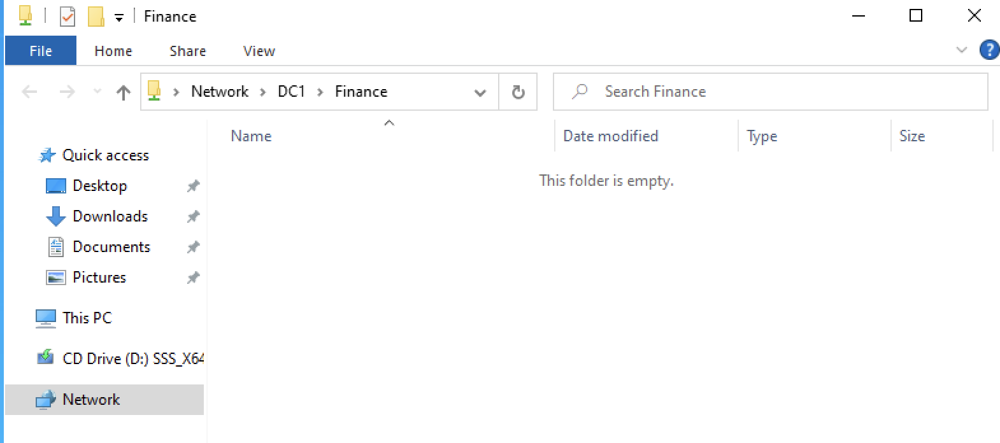

IT share access denied:

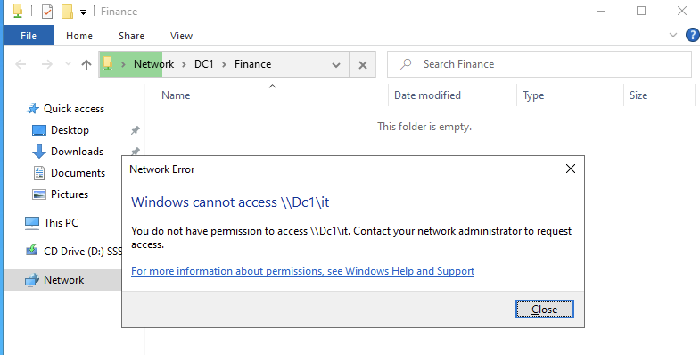

HR share access denied:

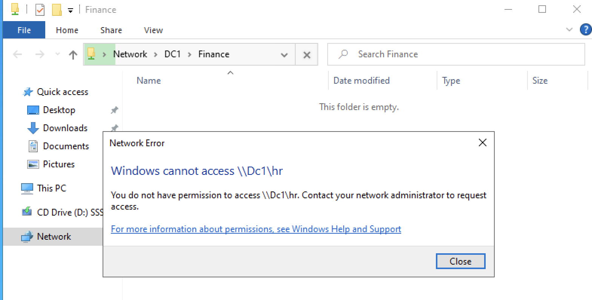

---

## Key Concepts Demonstrated

### Active Directory Access Model

```text
User → Security Group → Resource Permission
```

### DNS

```text
Name → DNS lookup → IP address
```

### Domain Login

```text
CLIENT01 → DNS → DC01 → Authentication
```

### File Share Access

```text
finance.user1
→ Group-Finance
→ \\DC1\Finance
→ Access allowed
```

```text
finance.user1
→ Not in Group-IT
→ \\DC1\IT
→ Access denied
```

---

## Troubleshooting Completed

During the lab, I resolved:

- DNS suffix issues caused by the host network suffix
- Domain Controller discovery failure using `nltest`
- DNS SRV lookup problems
- IPv6 DNS priority issues
- Domain join failure caused by incorrect DNS/DC discovery
- Share permission vs NTFS permission confusion

Commands used:

```powershell
ipconfig /all
ipconfig /flushdns
ipconfig /registerdns
nslookup
nltest /dsgetdc:erikcloud.local. /force
gpupdate /force
gpresult /r
Test-NetConnection
```

---

## Final Result

This lab successfully demonstrates a working Microsoft infrastructure environment with:

- Windows Server 2022 Domain Controller
- Active Directory domain
- DNS
- Group Policy
- Domain-joined client
- Department security groups
- SMB shares
- NTFS permissions
- End-to-end user access validation
